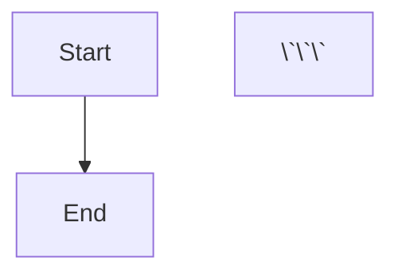
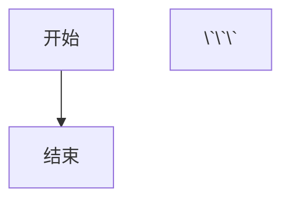

# API Documentation

[English](#english) | [简体中文](#简体中文)

---

## English

### Table of Contents

- [Components](#components)
  - [CanvasEditor](#canvaseditor)
  - [MarkdownPreviewPanel](#markdownpreviewpanel)
  - [EditorConfig](#editorconfig)
- [Type Definitions](#type-definitions)
- [Plugin System](#plugin-system)

---

## Components

### CanvasEditor

Main Markdown editor component with Canvas + DOM hybrid rendering.

#### Props

| Prop | Type | Default | Description |
|------|------|---------|-------------|
| `modelValue` | `string` | `''` | Editor content, supports `v-model` |
| `theme` | `'light' \| 'dark'` | `'light'` | Editor theme |
| `fontSize` | `number` | `15` | Font size in pixels |
| `lineHeight` | `number` | `26` | Line height in pixels |
| `enableSyntaxHighlight` | `boolean` | `true` | Enable syntax highlighting |
| `showLineNumbers` | `boolean` | `true` | Show line numbers |
| `showToolbar` | `boolean` | `true` | Show toolbar |
| `toolbarItems` | `string[]` | See below | Toolbar button configuration |
| `scrollPercentage` | `number` | `0` | External scroll position (0-1) |
| `isSyncing` | `boolean` | `false` | Whether syncing scroll (avoid loops) |
| `customColors` | `Record<string, string>` | `{}` | Custom color configuration |

#### Default Toolbar Items

```typescript
[
  'theme-toggle',
  'divider',
  'h1',
  'h2',
  'divider',
  'bold',
  'italic',
  'divider',
  'unordered-list',
  'ordered-list',
  'blockquote',
  'code-block',
  'horizontal-rule',
  'divider',
  'link',
  'image'
]
```

#### Events

| Event | Parameters | Description |
|-------|------------|-------------|
| `update:modelValue` | `(value: string)` | Triggered when content changes |
| `update:scrollPercentage` | `(percentage: number)` | Triggered when scroll position changes |
| `scroll` | `(percentage: number)` | Scroll event |
| `update:theme` | `(theme: 'light' \| 'dark')` | Theme change event |

#### Usage Example

```vue
<template>
  <CanvasEditor
    v-model="content"
    :theme="theme"
    :font-size="16"
    :line-height="28"
    :show-line-numbers="true"
    :show-toolbar="true"
    @update:theme="handleThemeChange"
    @scroll="handleScroll"
  />
</template>

<script setup lang="ts">
import { ref } from 'vue'
import { CanvasEditor } from '@nywqs/vue-markdown-editor'

const content = ref('# Hello World')
const theme = ref<'light' | 'dark'>('light')

const handleThemeChange = (newTheme: 'light' | 'dark') => {
  theme.value = newTheme
}

const handleScroll = (percentage: number) => {
  console.log('Scroll percentage:', percentage)
}
</script>
```

---

### MarkdownPreviewPanel

Markdown preview component with real-time rendering.

#### Props

| Prop | Type | Default | Description |
|------|------|---------|-------------|
| `modelValue` | `string` | `''` | Markdown content to preview |
| `theme` | `'light' \| 'dark'` | `'light'` | Preview theme |
| `scrollPercentage` | `number` | `0` | External scroll position (0-1) |
| `isSyncing` | `boolean` | `false` | Whether syncing scroll |

#### Events

| Event | Parameters | Description |
|-------|------------|-------------|
| `update:scrollPercentage` | `(percentage: number)` | Scroll position change |
| `scroll` | `(percentage: number)` | Scroll event |

#### Usage Example

```vue
<template>
  <MarkdownPreviewPanel
    :model-value="content"
    :theme="theme"
    :scroll-percentage="scrollPercentage"
    :is-syncing="isSyncing"
    @scroll="handleScroll"
  />
</template>

<script setup lang="ts">
import { ref } from 'vue'
import { MarkdownPreviewPanel } from '@nywqs/vue-markdown-editor'

const content = ref('# Preview\n\nThis is **bold** text.')
const theme = ref<'light' | 'dark'>('light')
const scrollPercentage = ref(0)
const isSyncing = ref(false)

const handleScroll = (percentage: number) => {
  scrollPercentage.value = percentage
}
</script>
```

---

### EditorConfig

Editor configuration panel component.

#### Props

| Prop | Type | Default | Description |
|------|------|---------|-------------|
| `theme` | `'light' \| 'dark'` | `'light'` | Current theme |
| `fontSize` | `number` | `15` | Font size |
| `lineHeight` | `number` | `26` | Line height |
| `enableSyntaxHighlight` | `boolean` | `true` | Syntax highlighting enabled |
| `customColors` | `Record<string, string>` | `{}` | Custom colors |

#### Events

| Event | Parameters | Description |
|-------|------------|-------------|
| `update:theme` | `(theme: 'light' \| 'dark')` | Theme change |
| `update:fontSize` | `(size: number)` | Font size change |
| `update:lineHeight` | `(height: number)` | Line height change |
| `update:enableSyntaxHighlight` | `(enabled: boolean)` | Syntax highlight toggle |
| `update:customColors` | `(colors: Record<string, string>)` | Custom colors change |

#### Usage Example

```vue
<template>
  <EditorConfig
    v-model:theme="theme"
    v-model:font-size="fontSize"
    v-model:line-height="lineHeight"
    v-model:enable-syntax-highlight="syntaxHighlight"
  />
</template>

<script setup lang="ts">
import { ref } from 'vue'
import { EditorConfig } from '@nywqs/vue-markdown-editor'

const theme = ref<'light' | 'dark'>('light')
const fontSize = ref(15)
const lineHeight = ref(26)
const syntaxHighlight = ref(true)
</script>
```

---

## Type Definitions

### Core Types

```typescript
// Theme type
type Theme = 'light' | 'dark'

// Cursor position
interface CursorPosition {
  line: number
  column: number
}

// Selection range
interface SelectionRange {
  startLine: number
  startColumn: number
  endLine: number
  endColumn: number
}

// Editor configuration
interface EditorConfig {
  theme: Theme
  fontSize: number
  lineHeight: number
  enableSyntaxHighlight: boolean
  showLineNumbers: boolean
  showToolbar: boolean
}

// Toolbar item types
type ToolbarItem = 
  | 'theme-toggle'
  | 'h1' | 'h2' | 'h3'
  | 'bold' | 'italic'
  | 'unordered-list' | 'ordered-list'
  | 'blockquote' | 'code-block'
  | 'horizontal-rule'
  | 'link' | 'image'
  | 'divider'

// Plugin button configuration
interface ToolbarButton {
  id: string
  icon: string
  title: string
  command: string
  commandArgs?: any[]
}
```

---

## Plugin System

### Built-in Plugins

#### TablePlugin

Insert and edit tables.

**Shortcut**: `Ctrl+Shift+T`

**Usage**: Automatically activated, use keyboard shortcut to insert table.

---

#### MathPlugin

Math formula support using KaTeX.

**Shortcut**: `Ctrl+M`

**Usage**: 
- Inline formula: `$formula$`
- Block formula: `$$formula$$`

---

#### MermaidPlugin

Flowchart and diagram support.

**Shortcut**: `Ctrl+Shift+D`

**Usage**:
```markdown


---

#### TodoListPlugin

Todo list support.

**Usage**:
```markdown
- [ ] Uncompleted task
- [x] Completed task
```

---

#### AutoCompletePlugin

Smart auto-completion for Markdown syntax.

**Features**:
- Bracket matching: `()`, `[]`, `{}`
- Quote matching: `""`, `''`
- Markdown syntax hints

---

#### SyntaxCheckerPlugin

Real-time syntax checking and error hints.

**Features**:
- Markdown syntax validation
- Link validity check
- Image path verification

---

### Custom Plugin Development

```typescript
import { Plugin } from '@nywqs/vue-markdown-editor'

class MyCustomPlugin implements Plugin {
  name = 'my-custom-plugin'
  version = '1.0.0'
  
  activate(context: PluginContext) {
    // Plugin initialization logic
    console.log('Plugin activated')
  }
  
  deactivate() {
    // Plugin cleanup logic
    console.log('Plugin deactivated')
  }
  
  // Optional: Register toolbar button
  getToolbarButtons() {
    return [{
      id: 'my-button',
      icon: '🔧',
      title: 'My Custom Feature',
      command: 'myCustomCommand',
      commandArgs: []
    }]
  }
  
  // Optional: Handle keyboard shortcuts
  handleKeybinding(event: KeyboardEvent) {
    if (event.ctrlKey && event.key === 'k') {
      // Handle Ctrl+K
      return true // Prevent default behavior
    }
    return false
  }
}

// Register plugin
pluginManager.register(MyCustomPlugin)
await pluginManager.activate('my-custom-plugin')
```

---

## Keyboard Shortcuts

| Shortcut | Action |
|----------|--------|
| `Ctrl+A` | Select all |
| `Ctrl+C` | Copy |
| `Ctrl+X` | Cut |
| `Ctrl+V` | Paste |
| `Ctrl+Z` | Undo |
| `Ctrl+Y` / `Ctrl+Shift+Z` | Redo |
| `Ctrl+F` | Search |
| `Ctrl+H` | Replace |
| `Ctrl+D` | Delete current line |
| `Tab` | Indent |
| `Shift+Tab` | Outdent |
| `Ctrl+M` | Insert math formula |
| `Ctrl+Shift+T` | Insert table |
| `Ctrl+Shift+D` | Insert diagram |

---

## Performance Optimization

### Viewport Clipping

Only renders visible content area:

```typescript
// Automatically enabled
// No configuration needed
```

### Virtual Scrolling

Buffer mechanism for smooth scrolling:

```typescript
// Built-in optimization
// Automatically adjusts based on document size
```

### Incremental Rendering

Only redraws changed lines:

```typescript
// Automatically triggered on content changes
// 3-5x performance improvement
```

---

## Advanced Usage

### Custom Theme Colors

```vue
<template>
  <CanvasEditor
    v-model="content"
    :custom-colors="customColors"
  />
</template>

<script setup lang="ts">
import { ref } from 'vue'

const customColors = ref({
  background: '#1e1e1e',
  text: '#d4d4d4',
  selection: 'rgba(100, 150, 255, 0.3)',
  lineNumber: '#858585'
})
</script>
```

### Scroll Synchronization

```typescript
// Editor → Preview sync
const handleEditorScroll = (percentage: number) => {
  if (isSyncingPreview.value) return
  isSyncingEditor.value = true
  previewScrollPercentage.value = percentage
  setTimeout(() => isSyncingEditor.value = false, 100)
}

// Preview → Editor sync
const handlePreviewScroll = (percentage: number) => {
  if (isSyncingEditor.value) return
  isSyncingPreview.value = true
  editorScrollPercentage.value = percentage
  setTimeout(() => isSyncingPreview.value = false, 100)
}
```

---

## Browser Compatibility

- Chrome >= 90
- Firefox >= 88
- Safari >= 14
- Edge >= 90

---

## License

MIT © [nywqs](https://github.com/leoncheng2030)

---

<a name="简体中文"></a>

## 简体中文

### 目录

- [组件](#组件)
  - [CanvasEditor](#canvaseditor-1)
  - [MarkdownPreviewPanel](#markdownpreviewpanel-1)
  - [EditorConfig](#editorconfig-1)
- [类型定义](#类型定义)
- [插件系统](#插件系统-1)

---

## 组件

### CanvasEditor

主 Markdown 编辑器组件，采用 Canvas + DOM 混合渲染。

#### 属性（Props）

| 属性 | 类型 | 默认值 | 说明 |
|------|------|--------|------|
| `modelValue` | `string` | `''` | 编辑器内容，支持 `v-model` |
| `theme` | `'light' \| 'dark'` | `'light'` | 编辑器主题 |
| `fontSize` | `number` | `15` | 字体大小（像素） |
| `lineHeight` | `number` | `26` | 行高（像素） |
| `enableSyntaxHighlight` | `boolean` | `true` | 启用语法高亮 |
| `showLineNumbers` | `boolean` | `true` | 显示行号 |
| `showToolbar` | `boolean` | `true` | 显示工具栏 |
| `toolbarItems` | `string[]` | 见下文 | 工具栏按钮配置 |
| `scrollPercentage` | `number` | `0` | 外部滚动位置（0-1） |
| `isSyncing` | `boolean` | `false` | 是否正在同步滚动（避免循环） |
| `customColors` | `Record<string, string>` | `{}` | 自定义颜色配置 |

#### 默认工具栏项

```typescript
[
  'theme-toggle',      // 主题切换
  'divider',           // 分隔符
  'h1',                // 一级标题
  'h2',                // 二级标题
  'divider',
  'bold',              // 加粗
  'italic',            // 斜体
  'divider',
  'unordered-list',    // 无序列表
  'ordered-list',      // 有序列表
  'blockquote',        // 引用
  'code-block',        // 代码块
  'horizontal-rule',   // 水平线
  'divider',
  'link',              // 链接
  'image'              // 图片
]
```

#### 事件（Events）

| 事件 | 参数 | 说明 |
|------|------|------|
| `update:modelValue` | `(value: string)` | 内容变化时触发 |
| `update:scrollPercentage` | `(percentage: number)` | 滚动位置变化时触发 |
| `scroll` | `(percentage: number)` | 滚动事件 |
| `update:theme` | `(theme: 'light' \| 'dark')` | 主题变化事件 |

#### 使用示例

```vue
<template>
  <CanvasEditor
    v-model="content"
    :theme="theme"
    :font-size="16"
    :line-height="28"
    :show-line-numbers="true"
    :show-toolbar="true"
    @update:theme="handleThemeChange"
    @scroll="handleScroll"
  />
</template>

<script setup lang="ts">
import { ref } from 'vue'
import { CanvasEditor } from '@nywqs/vue-markdown-editor'

const content = ref('# 你好世界')
const theme = ref<'light' | 'dark'>('light')

const handleThemeChange = (newTheme: 'light' | 'dark') => {
  theme.value = newTheme
}

const handleScroll = (percentage: number) => {
  console.log('滚动百分比:', percentage)
}
</script>
```

---

### MarkdownPreviewPanel

Markdown 预览组件，支持实时渲染。

#### 属性（Props）

| 属性 | 类型 | 默认值 | 说明 |
|------|------|--------|------|
| `modelValue` | `string` | `''` | 要预览的 Markdown 内容 |
| `theme` | `'light' \| 'dark'` | `'light'` | 预览主题 |
| `scrollPercentage` | `number` | `0` | 外部滚动位置（0-1） |
| `isSyncing` | `boolean` | `false` | 是否正在同步滚动 |

#### 事件（Events）

| 事件 | 参数 | 说明 |
|------|------|------|
| `update:scrollPercentage` | `(percentage: number)` | 滚动位置变化 |
| `scroll` | `(percentage: number)` | 滚动事件 |

#### 使用示例

```vue
<template>
  <MarkdownPreviewPanel
    :model-value="content"
    :theme="theme"
    :scroll-percentage="scrollPercentage"
    :is-syncing="isSyncing"
    @scroll="handleScroll"
  />
</template>

<script setup lang="ts">
import { ref } from 'vue'
import { MarkdownPreviewPanel } from '@nywqs/vue-markdown-editor'

const content = ref('# 预览\n\n这是**粗体**文本。')
const theme = ref<'light' | 'dark'>('light')
const scrollPercentage = ref(0)
const isSyncing = ref(false)

const handleScroll = (percentage: number) => {
  scrollPercentage.value = percentage
}
</script>
```

---

### EditorConfig

编辑器配置面板组件。

#### 属性（Props）

| 属性 | 类型 | 默认值 | 说明 |
|------|------|--------|------|
| `theme` | `'light' \| 'dark'` | `'light'` | 当前主题 |
| `fontSize` | `number` | `15` | 字体大小 |
| `lineHeight` | `number` | `26` | 行高 |
| `enableSyntaxHighlight` | `boolean` | `true` | 是否启用语法高亮 |
| `customColors` | `Record<string, string>` | `{}` | 自定义颜色 |

#### 事件（Events）

| 事件 | 参数 | 说明 |
|------|------|------|
| `update:theme` | `(theme: 'light' \| 'dark')` | 主题变化 |
| `update:fontSize` | `(size: number)` | 字体大小变化 |
| `update:lineHeight` | `(height: number)` | 行高变化 |
| `update:enableSyntaxHighlight` | `(enabled: boolean)` | 语法高亮切换 |
| `update:customColors` | `(colors: Record<string, string>)` | 自定义颜色变化 |

#### 使用示例

```vue
<template>
  <EditorConfig
    v-model:theme="theme"
    v-model:font-size="fontSize"
    v-model:line-height="lineHeight"
    v-model:enable-syntax-highlight="syntaxHighlight"
  />
</template>

<script setup lang="ts">
import { ref } from 'vue'
import { EditorConfig } from '@nywqs/vue-markdown-editor'

const theme = ref<'light' | 'dark'>('light')
const fontSize = ref(15)
const lineHeight = ref(26)
const syntaxHighlight = ref(true)
</script>
```

---

## 类型定义

### 核心类型

```typescript
// 主题类型
type Theme = 'light' | 'dark'

// 光标位置
interface CursorPosition {
  line: number
  column: number
}

// 选区范围
interface SelectionRange {
  startLine: number
  startColumn: number
  endLine: number
  endColumn: number
}

// 编辑器配置
interface EditorConfig {
  theme: Theme
  fontSize: number
  lineHeight: number
  enableSyntaxHighlight: boolean
  showLineNumbers: boolean
  showToolbar: boolean
}

// 工具栏项类型
type ToolbarItem = 
  | 'theme-toggle'
  | 'h1' | 'h2' | 'h3'
  | 'bold' | 'italic'
  | 'unordered-list' | 'ordered-list'
  | 'blockquote' | 'code-block'
  | 'horizontal-rule'
  | 'link' | 'image'
  | 'divider'

// 插件按钮配置
interface ToolbarButton {
  id: string
  icon: string
  title: string
  command: string
  commandArgs?: any[]
}
```

---

## 插件系统

### 内置插件

#### TablePlugin

插入和编辑表格。

**快捷键**：`Ctrl+Shift+T`

**用法**：自动激活，使用快捷键插入表格。

---

#### MathPlugin

使用 KaTeX 支持数学公式。

**快捷键**：`Ctrl+M`

**用法**：
- 行内公式：`$公式$`
- 块级公式：`$$公式$$`

---

#### MermaidPlugin

流程图和图表支持。

**快捷键**：`Ctrl+Shift+D`

**用法**：
```markdown


---

#### TodoListPlugin

待办列表支持。

**用法**：
```markdown
- [ ] 未完成任务
- [x] 已完成任务
```

---

#### AutoCompletePlugin

Markdown 语法智能补全。

**功能**：
- 括号匹配：`()`、`[]`、`{}`
- 引号匹配：`""`、`''`
- Markdown 语法提示

---

#### SyntaxCheckerPlugin

实时语法检查和错误提示。

**功能**：
- Markdown 语法验证
- 链接有效性检查
- 图片路径验证

---

### 自定义插件开发

```typescript
import { Plugin } from '@nywqs/vue-markdown-editor'

class MyCustomPlugin implements Plugin {
  name = 'my-custom-plugin'
  version = '1.0.0'
  
  activate(context: PluginContext) {
    // 插件初始化逻辑
    console.log('插件已激活')
  }
  
  deactivate() {
    // 插件清理逻辑
    console.log('插件已停用')
  }
  
  // 可选：注册工具栏按钮
  getToolbarButtons() {
    return [{
      id: 'my-button',
      icon: '🔧',
      title: '我的自定义功能',
      command: 'myCustomCommand',
      commandArgs: []
    }]
  }
  
  // 可选：处理键盘快捷键
  handleKeybinding(event: KeyboardEvent) {
    if (event.ctrlKey && event.key === 'k') {
      // 处理 Ctrl+K
      return true // 阻止默认行为
    }
    return false
  }
}

// 注册插件
pluginManager.register(MyCustomPlugin)
await pluginManager.activate('my-custom-plugin')
```

---

## 键盘快捷键

| 快捷键 | 操作 |
|--------|------|
| `Ctrl+A` | 全选 |
| `Ctrl+C` | 复制 |
| `Ctrl+X` | 剪切 |
| `Ctrl+V` | 粘贴 |
| `Ctrl+Z` | 撤销 |
| `Ctrl+Y` / `Ctrl+Shift+Z` | 重做 |
| `Ctrl+F` | 搜索 |
| `Ctrl+H` | 替换 |
| `Ctrl+D` | 删除当前行 |
| `Tab` | 增加缩进 |
| `Shift+Tab` | 减少缩进 |
| `Ctrl+M` | 插入数学公式 |
| `Ctrl+Shift+T` | 插入表格 |
| `Ctrl+Shift+D` | 插入流程图 |

---

## 性能优化

### 视口裁剪

仅渲染可见内容区域：

```typescript
// 自动启用
// 无需配置
```

### 虚拟滚动

缓冲区机制实现流畅滚动：

```typescript
// 内置优化
// 根据文档大小自动调整
```

### 增量渲染

仅重绘变更的行：

```typescript
// 内容变化时自动触发
// 性能提升 3-5 倍
```

---

## 高级用法

### 自定义主题颜色

```vue
<template>
  <CanvasEditor
    v-model="content"
    :custom-colors="customColors"
  />
</template>

<script setup lang="ts">
import { ref } from 'vue'

const customColors = ref({
  background: '#1e1e1e',
  text: '#d4d4d4',
  selection: 'rgba(100, 150, 255, 0.3)',
  lineNumber: '#858585'
})
</script>
```

### 滚动同步

```typescript
// 编辑器 → 预览 同步
const handleEditorScroll = (percentage: number) => {
  if (isSyncingPreview.value) return
  isSyncingEditor.value = true
  previewScrollPercentage.value = percentage
  setTimeout(() => isSyncingEditor.value = false, 100)
}

// 预览 → 编辑器 同步
const handlePreviewScroll = (percentage: number) => {
  if (isSyncingEditor.value) return
  isSyncingPreview.value = true
  editorScrollPercentage.value = percentage
  setTimeout(() => isSyncingPreview.value = false, 100)
}
```

---

## 浏览器兼容性

- Chrome >= 90
- Firefox >= 88
- Safari >= 14
- Edge >= 90

---

## 开源协议

MIT © [nywqs](https://github.com/leoncheng2030)
